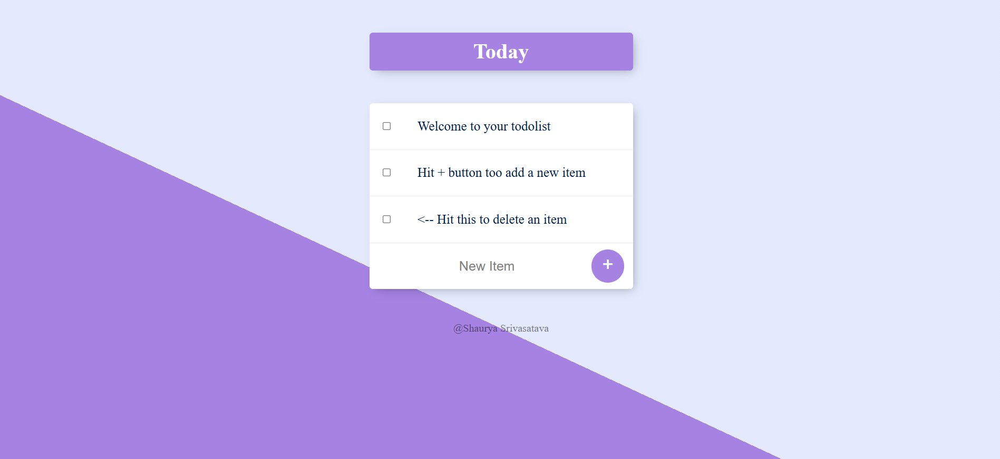

# ToDoList-V2

A simple yet functional to-do list application that stores tasks in a database.

## Table of Contents
- [ToDoList-V2](#todolist-v2)
  - [Table of Contents](#table-of-contents)
  - [Description](#description)
  - [Features](#features)
  - [Tech Stack](#tech-stack)
  - [Installation](#installation)
  - [Usage](#usage)
  - [Configuration](#configuration)
  - [Database](#database)
  - [Folder Structure](#folder-structure)
  - [Screenshots](#screenshots)
  - [Contributing](#contributing)

---

## Description
A minimalist to-do app allowing users to add, view, and manage tasks, with persistent storage via a database. Built using JavaScript, EJS, HTML, and CSS.

## Features
- Add new tasks
- View existing tasks
- Mark tasks as completed or delete them (if implemented)
- Tasks are saved persistently using a database

## Tech Stack
- **Backend**: Node.js (Express)
- **Templating**: EJS (Embedded JavaScript)
- **Frontend**: HTML, CSS
- **Database**: MongoDB
- **Project Files**:
  - `app.js`: Main application logic  
  - `index.html` / EJS views: Frontend templates  
  - `public/css`: Stylesheets  
  - `package.json` / `package-lock.json`: Dependencies

## Installation

```bash
git clone https://github.com/Thunderer9506/ToDoList-V2.git
cd ToDoList-V2
npm install
```

Configure your database connection (see [Configuration](#configuration)), then run:

```bash
node app.js
```

Open your browser and go to `http://localhost:3000` (or whichever port is configured).

## Usage
1. Add a new task using the input field.
2. View your tasks listed below.
3. (Optional) Mark tasks as complete or delete them if those features are provided.

## Configuration
Update database settings in `app.js` (or a dedicated config file) to match your setup:

```js
const db = /* your DB connection (e.g., MongoDB URI or SQLite path) */;
```

## Database
Specify the type of database you're using and any setup steps (e.g., creating a `.env` file with credentials, initializing a schema, etc.).

## Folder Structure
```
ToDoList-V2/
├── app.js
├── package.json
├── package-lock.json
├── index.html (or .ejs files in views/)
├── public/
│   └── css/
└── views/ (for EJS templates)
```

## Screenshots





## Contributing
Contributions are welcome! Feel free to open issues or submit pull requests to improve features, fix bugs, or enhance the UI.
